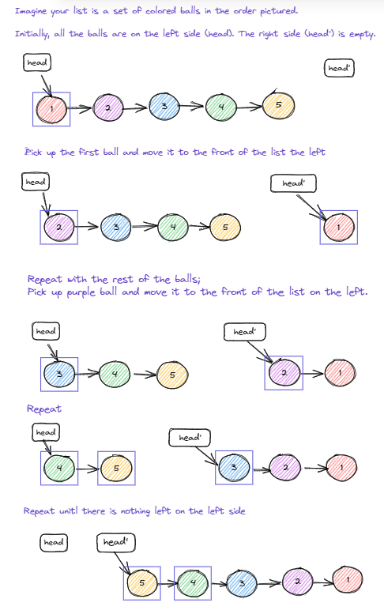

# Intuition

> My first thought was to use recursion, however reverseList method returns the head of the list
> I want it to return the tail.

# Approach



# Complexity

### Time complexity:

Since I picked up each ball only once the complexity is O(n)

### Space complexity:

Since all we did is rearrange the balls the space complexity is O(1)

# Code

```
    public ListNode reverseList(ListNode head) {
        if (head == null) {
            return null;
        }
        if (head.next == null) {
            return head;
        }
        ListNode headOfReverse = null;
        while (head != null) {
            ListNode theRest = head.next;
            head.next = headOfReverse;
            headOfReverse = head; 
            head = theRest;
        }
        return headOfReverse;
    }
```
